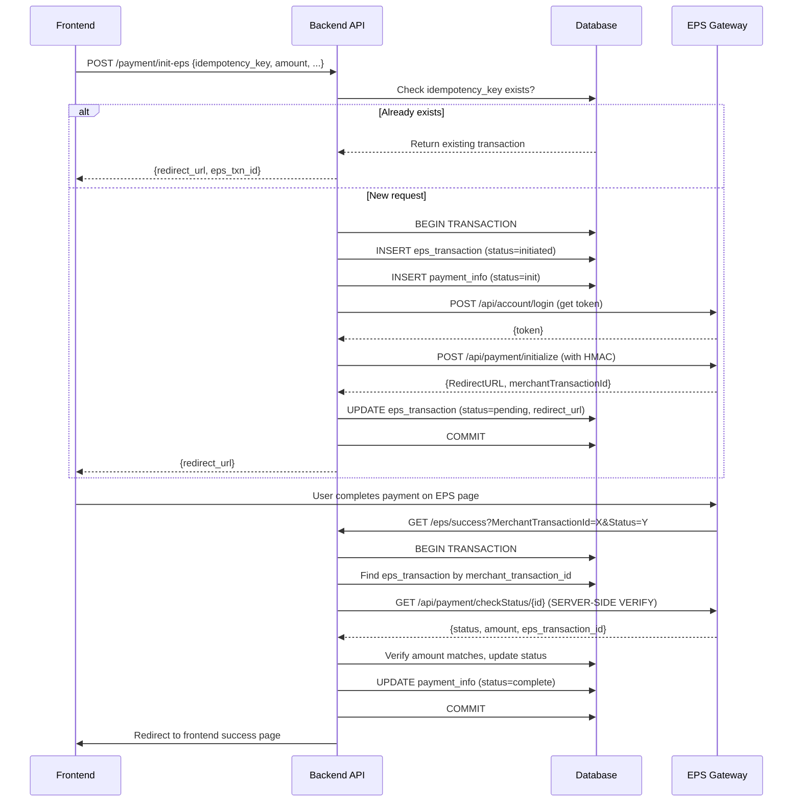

# EPS Payment Gateway Integration with DB Transactions & Deduplication

Integrate the [EPS-PG/EPS_Laravel](https://github.com/EPS-PG/EPS_Laravel) payment gateway into the Valo Kichu backend with **maximum safety**: DB transactions wrapping all payment flows, **idempotency/deduplication** via a dedicated `eps_transactions` table, and **server-side verification** of every callback using `CheckPaymentStatus`.

## User Review Required

> [!IMPORTANT]
> **Demo Credentials**: The plan uses the demo credentials you provided. These will be stored in `.env`. The `EPSBaseURL` is not in the credentials — is it `https://sandbox.eps.com.bd` or something else? Please confirm or provide the base URL.

> [!WARNING]
> **Callback URLs**: EPS redirects users to `successUrl`, `failUrl`, `cancelUrl` after payment. These need to be **publicly accessible URLs**. The plan uses your backend's web routes (e.g., `https://backend.valokichu.com/eps/success`). During local development, you'll need a tunnel (ngrok) or test with the production domain.

## Open Questions

1. **EPS Base URL**: What is the sandbox/live base URL? (e.g., `https://sandbox.eps.com.bd` or `https://pay.eps.com.bd`)
2. **EPSDeviceTypeID**: Not in the demo credentials — should it default to `1` (web)?
3. **IPN (Instant Payment Notification)**: The EPS SDK doesn't show an IPN endpoint. Should we add a server-to-server callback route for EPS to call, or is redirect-based verification sufficient?
4. **Frontend redirect**: After EPS payment completes, should we redirect to a frontend URL (e.g., `https://valokichu.com/payment/success?order_id=X`) or stay on the backend?

## Proposed Changes

### Database Layer

#### [NEW] Migration: `create_eps_transactions_table`

Creates the core deduplication & audit table:

```php
Schema::create('eps_transactions', function (Blueprint $table) {
    $table->id();
    $table->uuid('idempotency_key')->unique();          // Client-generated, prevents duplicate payments
    $table->string('merchant_transaction_id')->unique(); // Our invoice_id sent to EPS
    $table->string('eps_transaction_id')->nullable();    // EPS's own transaction ID (from callback)
    $table->unsignedBigInteger('order_id')->nullable();
    $table->unsignedBigInteger('payment_info_id')->nullable();
    $table->decimal('amount', 12, 2);
    $table->string('currency', 10)->default('BDT');
    $table->string('status', 30)->default('initiated');  // initiated, pending, verified, completed, failed, cancelled
    $table->string('customer_name')->nullable();
    $table->string('customer_email')->nullable();
    $table->string('customer_phone')->nullable();
    $table->json('eps_request_payload')->nullable();     // Full request sent to EPS
    $table->json('eps_response_payload')->nullable();    // Full response from EPS
    $table->json('eps_callback_payload')->nullable();    // Callback GET params
    $table->json('eps_verification_payload')->nullable();// CheckPaymentStatus response
    $table->string('redirect_url')->nullable();          // EPS redirect URL
    $table->string('ip_address')->nullable();
    $table->timestamp('initiated_at')->nullable();
    $table->timestamp('verified_at')->nullable();
    $table->timestamp('completed_at')->nullable();
    $table->integer('verification_attempts')->default(0);
    $table->timestamps();

    $table->index('status');
    $table->index('merchant_transaction_id');
    $table->index('eps_transaction_id');
    $table->index('order_id');
});
```

**Key Safety Features:**
- `idempotency_key` (unique) — frontend sends a UUID; if the same key arrives twice, we return the existing transaction instead of creating a new one → **deduplication**
- `merchant_transaction_id` (unique) — our invoice ID sent to EPS, prevents duplicate EPS API calls
- Full payload logging for audit trail

---

### EPS Service Layer

#### [NEW] [EPSPaymentService.php](file:///Users/rsmmonaem/Desktop/Nibiz%20TEMP/Valokichu/valo_kichu_backend/app/Services/EPSPaymentService.php)

A robust service wrapping the EPS API with DB transactions:

```
EPSPaymentService
├── __construct()           — Loads config, validates credentials
├── generateHash()          — HMAC-SHA512 hash generation
├── getToken()              — Authenticates with EPS, gets Bearer token
├── initializePayment()     — Full flow with deduplication:
│   ├── Check idempotency_key → return existing if found
│   ├── DB::transaction {
│   │   ├── Create eps_transaction record (status=initiated)
│   │   ├── Create PaymentInfo record (status=init)
│   │   ├── Call EPS /api/payment/initialize
│   │   ├── Store response + redirect URL
│   │   └── Update status to pending
│   │   }
│   └── Return redirect URL
├── handleCallback()        — Process success/fail/cancel callbacks:
│   ├── DB::transaction {
│   │   ├── Find eps_transaction by merchant_transaction_id
│   │   ├── Verify with EPS /api/payment/checkStatus (server-side!)
│   │   ├── Compare amounts, check for tampering
│   │   ├── Update eps_transaction status
│   │   ├── Update PaymentInfo status
│   │   └── Link to Order if applicable
│   │   }
│   └── Redirect to frontend
└── verifyPayment()         — Standalone verification via EPS API
```

**Triple-Layer Safety:**
1. **Idempotency** — Same `idempotency_key` never creates duplicate payments
2. **DB Transactions** — All DB writes are atomic; if any step fails, everything rolls back
3. **Server-Side Verification** — Never trust callbacks alone; always call `CheckPaymentStatus` to verify with EPS directly

---

### Model

#### [NEW] [EpsTransaction.php](file:///Users/rsmmonaem/Desktop/Nibiz%20TEMP/Valokichu/valo_kichu_backend/app/Models/EpsTransaction.php)

Eloquent model with status constants, relationships to `PaymentInfo` and `Order`.

---

### Config

#### [NEW] [config/epsPayment.php](file:///Users/rsmmonaem/Desktop/Nibiz%20TEMP/Valokichu/valo_kichu_backend/config/epsPayment.php)

Configuration file sourcing from `.env`:
```php
return [
    'apiCredentials' => [
        'EPSUserName'     => env('EPSUserName'),
        'EPSPassword'     => env('EPSPassword'),
        'EPSDeviceTypeID' => env('EPSDeviceTypeID', 1),
        'EPSHashkey'      => env('EPSHashkey'),
        'EPSMerchentID'   => env('EPSMerchentID'),
        'EPSStoreID'      => env('EPSStoreID'),
    ],
    'EPSBaseURL' => env('EPSBaseURL'),
    'apiUrl' => [
        'GetToken'           => '/api/account/login',
        'Initialize'         => '/api/payment/initialize',
        'CheckPaymentStatus' => '/api/payment/checkStatus/',
    ],
];
```

#### [MODIFY] [.env](file:///Users/rsmmonaem/Desktop/Nibiz%20TEMP/Valokichu/valo_kichu_backend/.env)

Add EPS credentials:
```diff
+# EPS Payment Gateway
+EPSBaseURL="https://sandbox.eps.com.bd"
+EPSMerchentID="29e8c70-0ac6-45eb-ba04-9fcb0aaed12a"
+EPSStoreID="d44e705f-9e3a-41e8-98b1-1674631637da"
+EPSUserName="Epsdemo@gmail.com"
+EPSPassword="Epsdemo258@"
+EPSHashkey="FHZxyzeps56789gfhg678ygu876o="
+EPSDeviceTypeID=1
```

---

### Controller

#### [MODIFY] [PaymentController.php](file:///Users/rsmmonaem/Desktop/Nibiz%20TEMP/Valokichu/valo_kichu_backend/app/Http/Controllers/PaymentController.php)

Add new methods:
- `initEpsPayment(Request)` — Accepts `idempotency_key`, `amount`, `products[]`, customer info → calls `EPSPaymentService::initializePayment()` → returns redirect URL
- `epsSuccess(Request)` — EPS success callback → calls `handleCallback('success')` → redirects to frontend
- `epsFail(Request)` — EPS fail callback
- `epsCancel(Request)` — EPS cancel callback
- `verifyEpsPayment(Request)` — API endpoint to manually verify/check status

Update `initPayment()` to include `'eps'` in the gateway validation list.

---

### Routes

#### [MODIFY] [routes/api.php](file:///Users/rsmmonaem/Desktop/Nibiz%20TEMP/Valokichu/valo_kichu_backend/routes/api.php)

```diff
 // Payment Callbacks - Public
+Route::get('/eps/success', [PaymentController::class, 'epsSuccess'])->name('eps.success');
+Route::get('/eps/fail', [PaymentController::class, 'epsFail'])->name('eps.fail');
+Route::get('/eps/cancel', [PaymentController::class, 'epsCancel'])->name('eps.cancel');

 // Inside auth middleware group:
+Route::post('/payment/init-eps', [PaymentController::class, 'initEpsPayment']);
+Route::post('/payment/verify-eps', [PaymentController::class, 'verifyEpsPayment']);
```

---

### Existing PaymentService

#### [MODIFY] [PaymentService.php](file:///Users/rsmmonaem/Desktop/Nibiz%20TEMP/Valokichu/valo_kichu_backend/app/Services/PaymentService.php)

Add EPS as a supported gateway in `createPayment()` — delegates to `EPSPaymentService` when `$gatewayName === 'eps'`.

## Architecture Flow



## Verification Plan

### Automated Tests
```bash
php artisan migrate --force
php artisan tinker  # Test EPS token generation manually
```

### Manual Verification
1. Run migration and verify `eps_transactions` table exists
2. Test EPS token endpoint with demo credentials
3. Test payment initialization → verify redirect URL works
4. Test callback handling → verify DB records are updated correctly
5. Test deduplication → send same `idempotency_key` twice → verify only one transaction created
6. Test DB transaction rollback → simulate EPS API failure → verify no orphaned records
